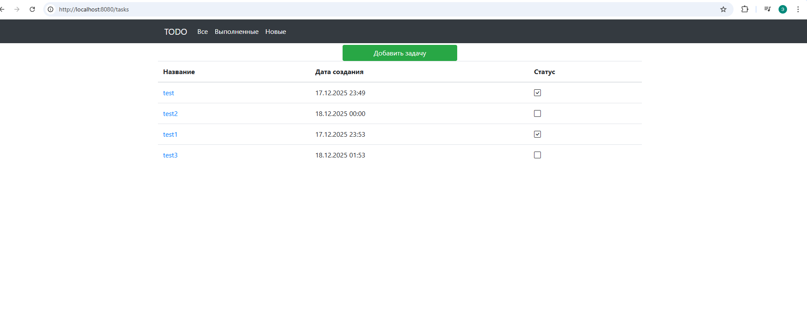
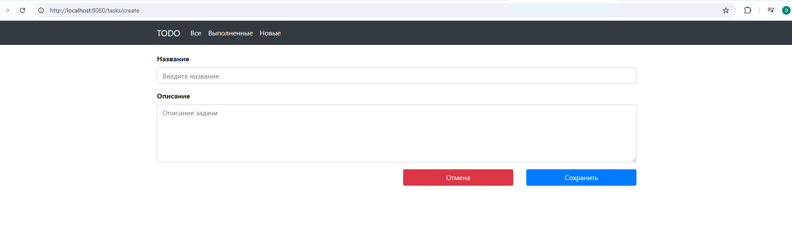
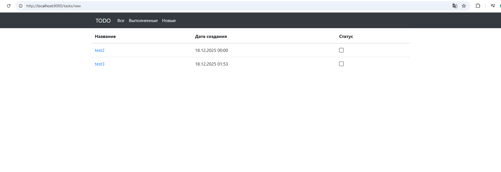
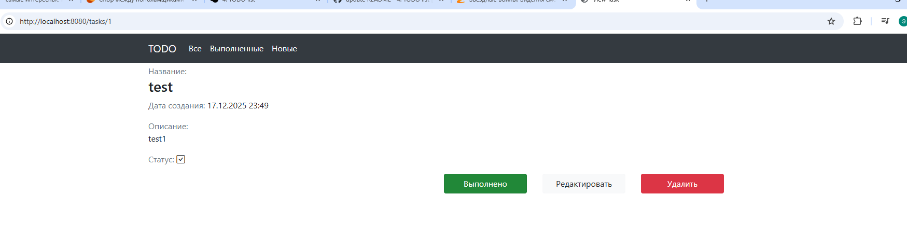
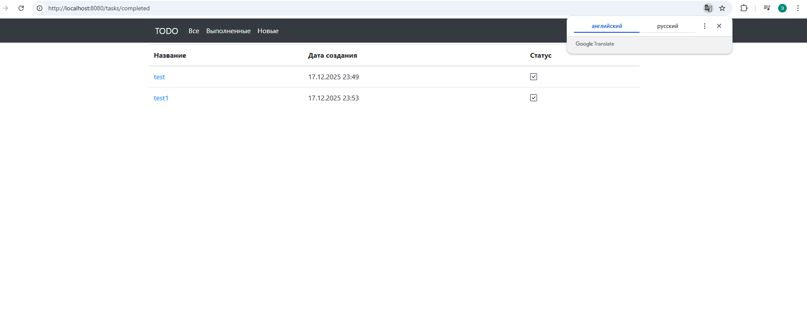
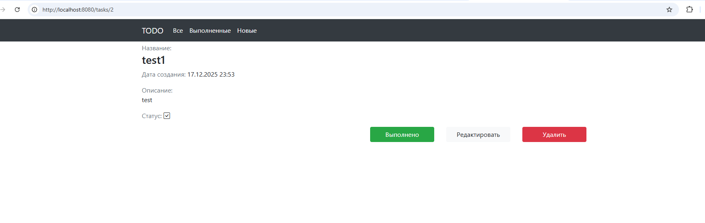

# job4j_todo

## Описание проекта
job4j_todo — это учебный проект, который представляет собой просто список дел.
Пользователь может создавать/ редактировать задачи. Все записи сохраняются в базу данных.

## Используемые технологии в проекте:
- Spring boot
- Thymeleaf
- Bootstrap
- PostgreSQL
- hibernate
- Liquibase

### Требования к окружению:
- Java 17
- Maven 3.9.3
- PostgreSQL 14

После успешного запуска приложение будет доступно по адресу: [http://localhost:8080](http://localhost:8080)

## Взаимодействие с приложением:

#### Список всех задач

#### Страница создания задачи

#### После создания, задача появляется в списке новых

#### Страница с подробным описанием задачи

#### Если нажали на кнопку выполнить, то задание переводится в состояние выполнено

#### Кнопка "Редактировать" переводит пользователя на отдельную страницу для редактирования

